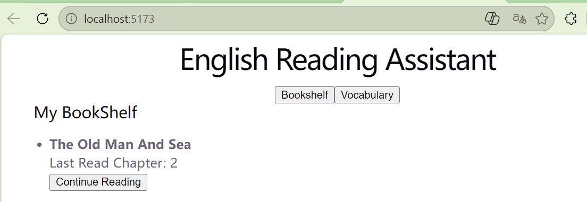

# English Reading Assistant

English Original Reading Assistant Based on Spring Boot + MyBatis + MySQL

## Tech Stack

Backend:

- Spring Boot
- MyBatis
- MySQL
- Maven

Frontend:

- Vue3
- Axios

## Features

- Book management
- Chapter reading
- Reading progress tracking
- Vue3 frontend
- Vocabulary management
- Duplicate Prevention
- Continue Reading

## Current API

GET /books

GET /chapters/book/{bookId}

GET /records/{userId}

POST /records

## Future

- AI reading assistant

## Project Presentation

## Author

WangJiaLe 
Computer Science Student 
Java Backend Development Leaner
