# English Reading Assistant

English Original Reading Assistant Based on ：Spring Boot + MyBatis + MySQL + Vue3 + Qwen-turbo + PostgreSQL + RAG + Redis

## Tech Stack

Backend:

- Spring Boot
- MyBatis
- Maven

Frontend:

- Vue3
- Axios

AI:

- Qwen-turbo

DATABASE:

- PostgreSQL
- MySQL
- Redis

## Features

- Book management
- Chapter reading
- Reading progress tracking
- Vue3 frontend
- Vocabulary management
- Duplicate Prevention
- Continue Reading
- Vocabulary Cache
- AI reading assistant
- Retrieval-Augmented Generation ehances AI searching ability
- Apply database schema migration via Flyway SQL scripts

## Current API

GET /books

GET /chapters/book/{bookId}

GET /records/{userId}

POST /records

FreeDictionaryAPI

Qwen-turbo API

Qwen-text-embedding-v4

## Future

- Optimize the splitting algorithm for English text
- Use a filter to screen out common article,conjunctions and other words that do not affect reading comprehension.
- Import PDF/EPUB Files
- Implement user login and registration functions

## Project Presentation :

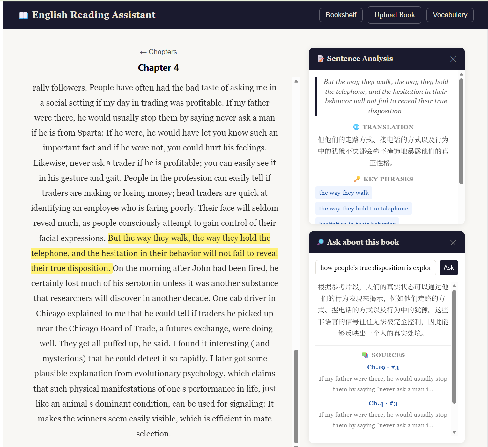

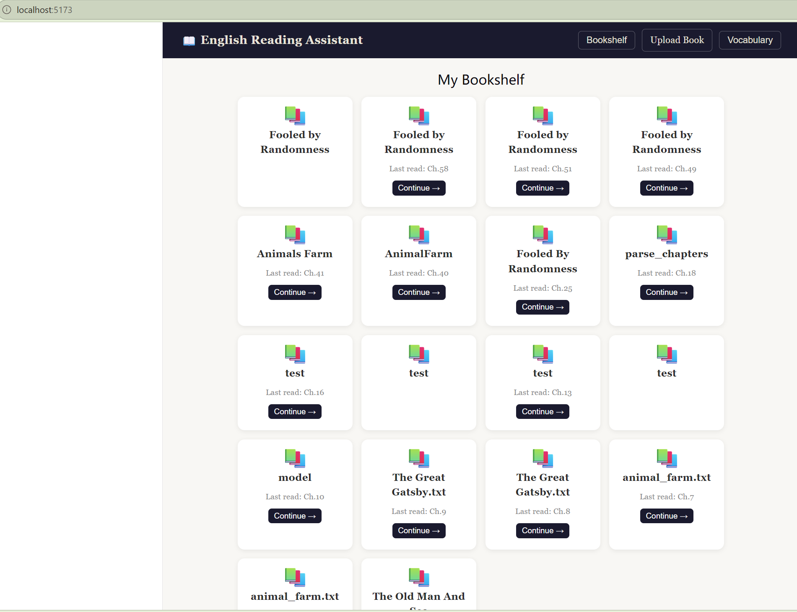

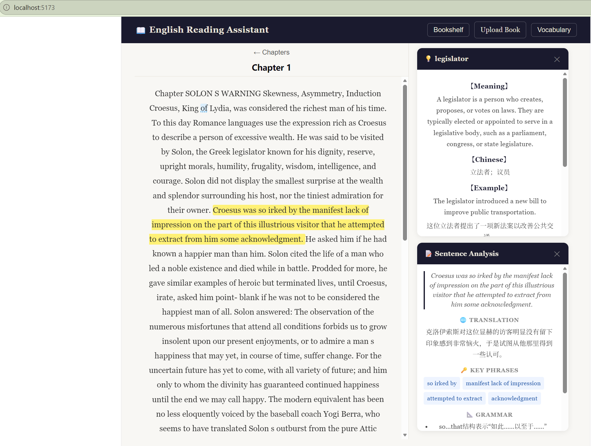

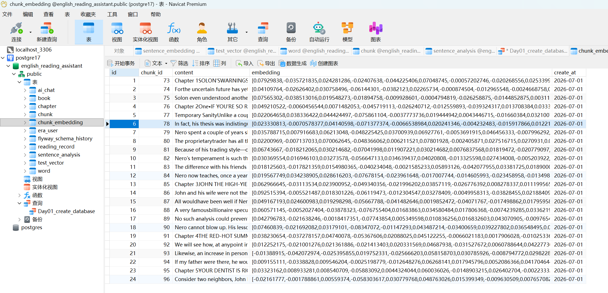

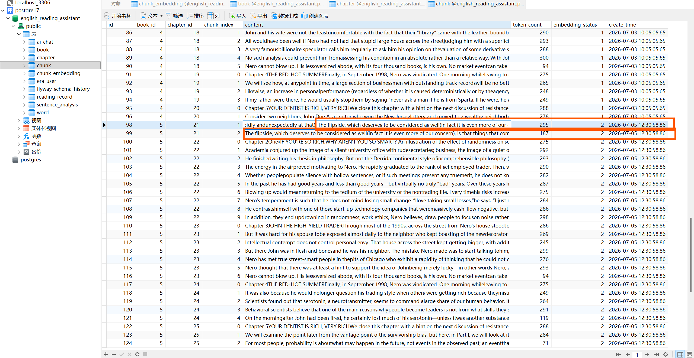

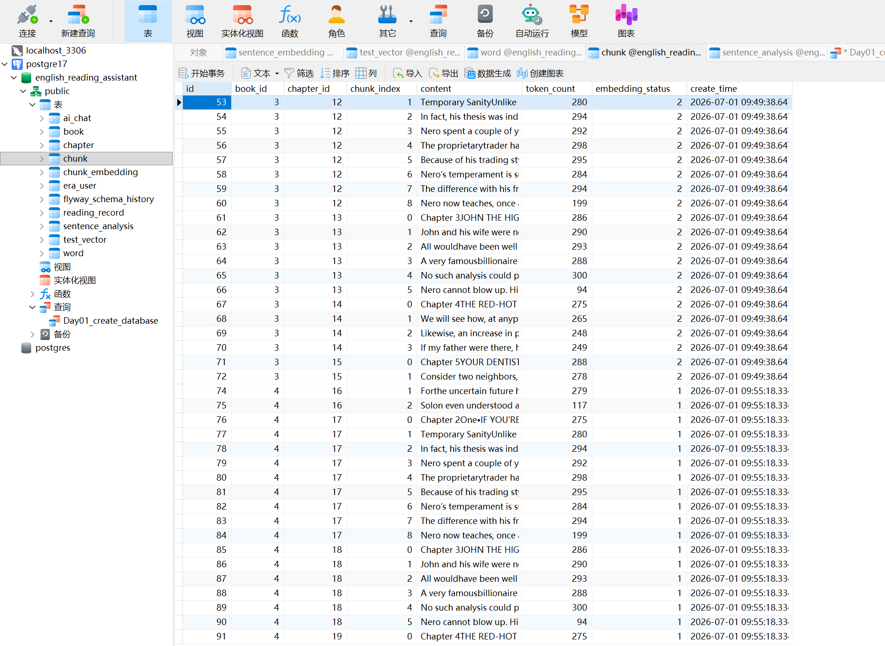

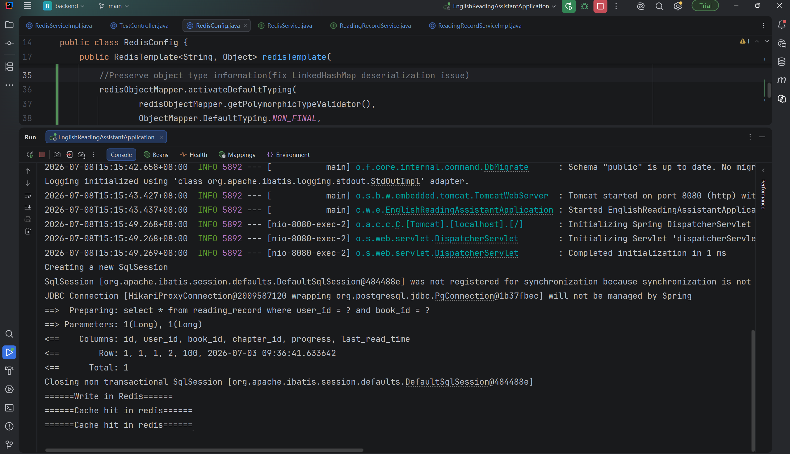

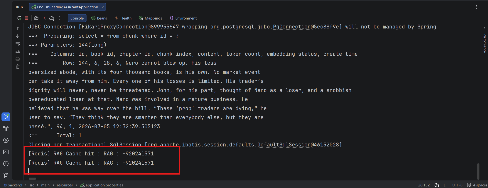

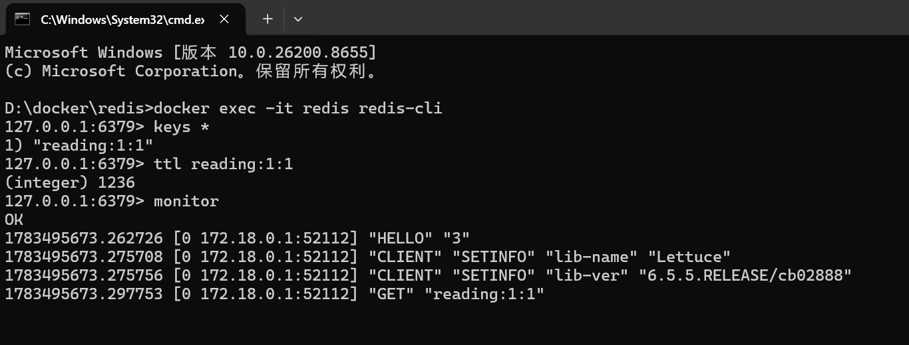

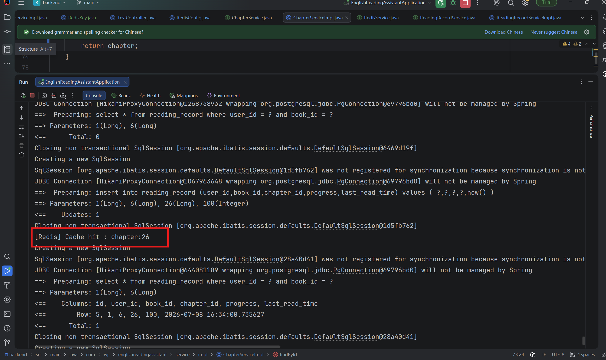

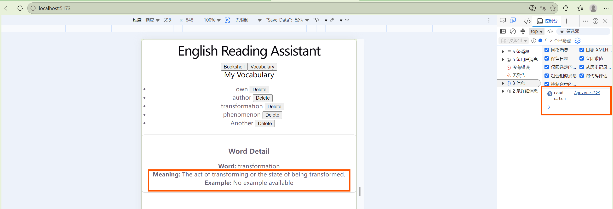

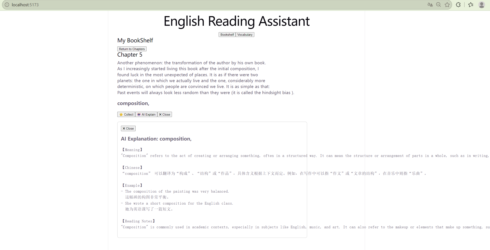

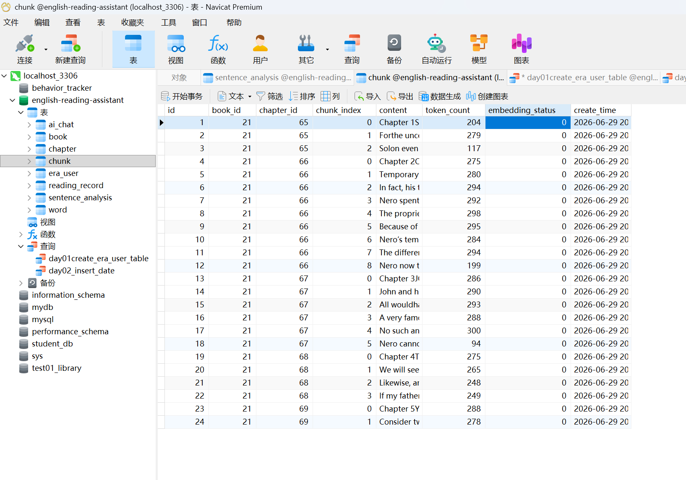

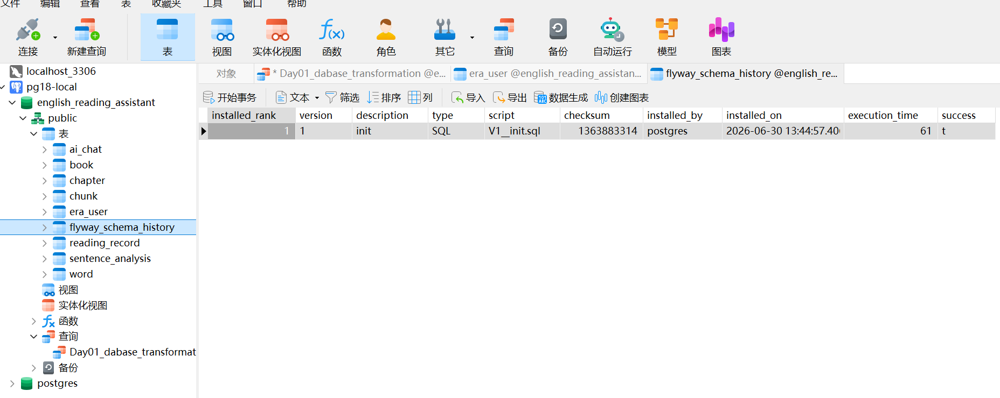

## Author

WangJiaLe 
Computer Science Student 
Java Backend Development Leaner
